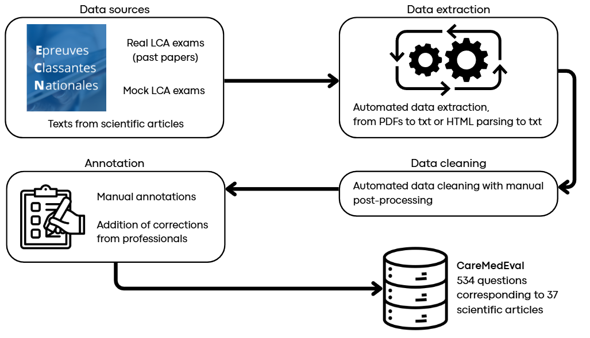
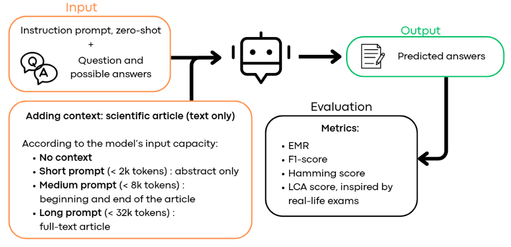
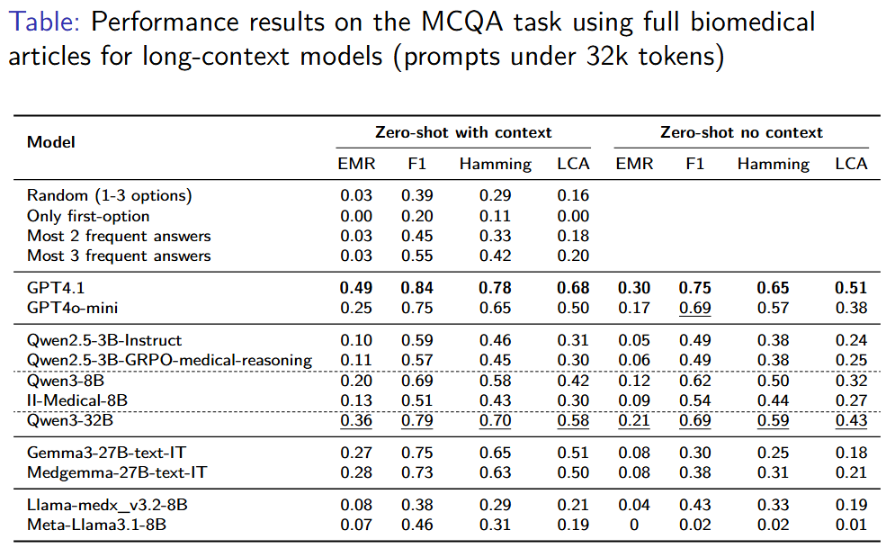
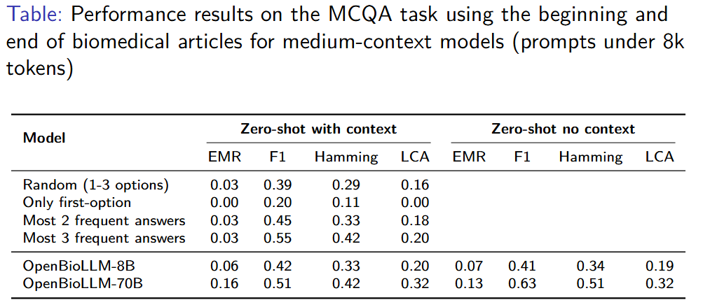
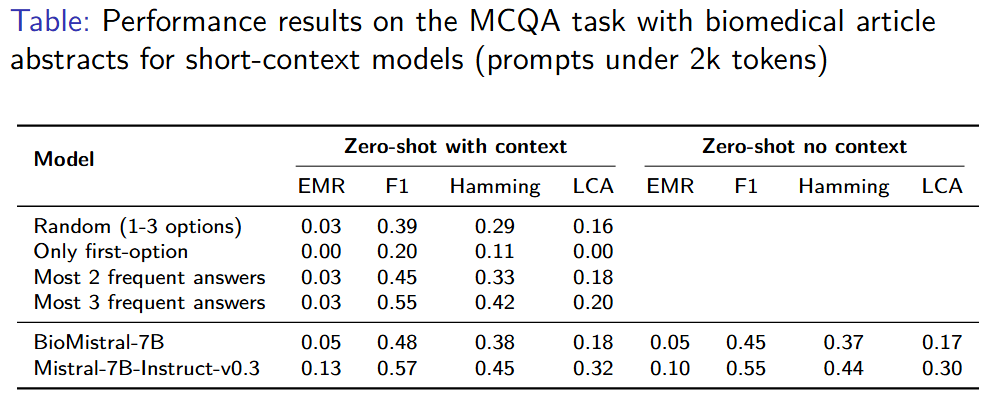
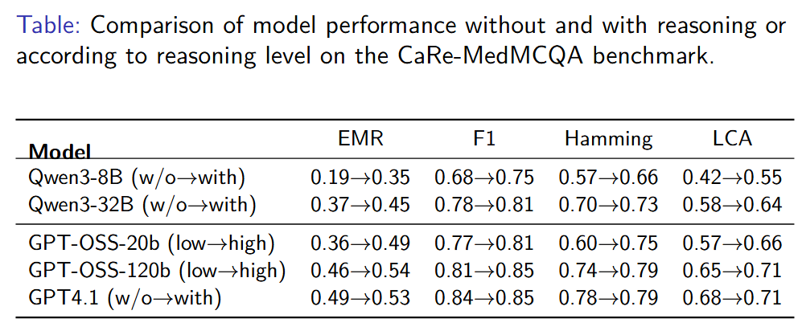

<h1 align="center"> CareMedEval dataset</h1>

<h3 align="center"> CareMedEval dataset: Evaluating Critical Appraisal and Reasoning in the Medical Field</h3>

|                        | Links                                               | 
| :--------------------: |:---------------------------------------------------:|
| **Repository**        |  [GitHub](https://github.com/bonzid/CareMedEval)          | 
| **Paper**  | TBA |
| **Contact**  |  [Doria BONZI](mailto:doria.bonzi@loria.fr), [Alexandre GUIGGI](mailto:alexandre.guiggi@gmail.com) |


<h3>Description</h3>

CareMedEval (**C**ritical **a**ppraisal and **R**easoning **Med**ical **Evaluation**) is a French Multiple Choice Question Answering (MCQA) dataset focused on evaluating critical appraisal skills in the medical field for scientific articles, as practiced in French medical education.

This dataset is composed of **534 questions taken from Lecture Critique d'Articles (LCA, "Critical Appraisal of research Articles) exams**, taken by sixth-year medical students in France. During the LCA exams, students are asked to answer a series of multiple-choice questions grounded in the critical reading of a given scientific article.

<h4>Source data</h4>

This dataset is built from two main sources:
- [Epreuves Classantes Nationales (ECN)](https://www.cng.sante.fr/candidats/internats/concours-medicaux/etudiants/epreuves-classantes-nationales-ecn) website, where we can find the official national LCA exams
- [Collège National des Enseignants de Thérapeutique (CNET)](https://therap.fr/lca/) website, which publishes mock LCA exams reviewed and approved by the CNET's educational committee to ensure alignment with real LCA exams. 

The articles used in these exams are publicly available online.

<br>
<p align="center">
  
  <br>
  <em>Figure.</em> CareMedEval dataset constitution pipeline.
</p>
<br>

<h4>Languages</h4>

The scientific articles are in English. The questions, answers, and justifications are originally in French. 
You can find in `./english_only/` a version of this dataset with automatically translated questions, answers and justifications, from French to English. We used Gemini 2.5 Flash for this translation. 

<h4>Annotations and labels</h4>

Each question in the CareMedEval dataset was manually annotated with one or more labels, reflecting the cognitive and analytical skills required to answer it. Question labeling was conducted by one annotator with a background in general medecine, using reference textbooks and their medical expertise. The labels are defined as follows:

| **Label** | **Description**                                    | **Skills required**           |
|-----------|----------------------------------------------------|-----------------------------------------|
| design   | Identification of study design                     | Information retrieval              |
| statistics   | Understanding and interpretation of statistics     | General knowledge, Information retrieval |
| methodology   | Knowledge of scientific methodology                | General conceptual understanding    |
| limitations   | Critical appraisal of biases and limitations          | Contextual reasoning                |
| applicability   | Clinical relevance and applicability               | Contextual reasoning                |


Since questions often target multiple dimensions of skills, they can be assigned more than one label. These labels can help to determine if certain categories of questions are more challenging than others for models, depending on the types of skills they require.

For data sourced from ECN website, we manually corrected the exam questions with the help of a general practitioner, as the official answer keys were not publicly available for these past exams.

For data from CNET website, we also collected the **correction and justifications provided by medical professionnals** for some questions. These justifications explain why some answers are correct or false, offering valuable insights into clinical reasoning and critical appraisal.


<h3>Dataset structure</h3>

- To access the full dataset, go to `./data/all/`, which contains both `/articles/` and `/questions.json`. 
- To access only the questions that include human justifications (204 questions out of 534), go to `./data/with_justifications/`.
- To access our manually annotated subset of 16 questions indicating whether questions require context (articles) to be answered correctly, go to `./data/requires_context/`.

<h4>Questions</h4>

Example of a question:

```
        "id": "fd30e0bb8cbe1d73039ffebab8e98019836a2e1af03b383f48be020d79f61310",
        "id_article": "article_3",
        "source_exam": "https://therap.fr/lca-mai-2019/",
        "date_exam": "2019",
        "article_link": "https://jamanetwork.com/journals/jama/fullarticle/2547755",
        "article_date": "2016",
        "question": "La publication de cet essai négatif :",
        "answers": {
            "a": "Est une situation rare les essais négatifs sont le plus souvent non publiés",
            "b": "Est inutile puisque n’apporte aucune information sur le traitement en pratique",
            "c": "Doit faire cesser toute investigation ultérieure sur cette molécule dans cette indication",
            "d": "Permettra d’intégrer plus facilement cet essai dans une revue systématique/metaanalyse",
            "e": "Est logique la publication des résultats de tous les essais est obligatoire"
        },
        "correct_answers": [
            "a",
            "d"
        ],
        "essential_answers": [],
        "unacceptable_answers": [],
        "labels": [
            "limitations",
            "applicability"
        ],
        "justification": "50% des essais sont non publiés et ce surtout s'ils sont négatifs. Savoir qu’un traitement n’est pas supérieur à un autre est en soi une information importante. Voir la discussion de l’essai. Une revue systématique pour donner un reflet réel de l’ensemble de la recherche sur une question doit inclure tous les essais réalisés qu’ils soient positifs ou négatifs, sinon l’éventuelle méta-analyse donnera un résultat biaisé. Il est plus simple de trouver les résultats si l’essai est publié. Hautement souhaitable et recommandée.",
        "nb_correct_answers": 2
```

Each question in the dataset is represented as a JSON object with the following fields:

| **Field**            | **Description** |
|----------------------|-----------------|
| `id`                 | A unique identifier for the question |
| `id_article`         | An internal ID linking the question to the corresponding article in the dataset |
| `source_exam`        | The URL of the exam or online resource (e.g., CNET or ECN) from which the question was extracted |
| `date_exam`          | The date on which the exam was presented |
| `article_link`       | The direct link to the full-text scientific article used as the basis for the question |
| `article_date`       | The date on which the article was published |
| `question`           | The multiple-choice question (MCQ) as presented in the exam |
| `answers`            | A dictionary mapping each option label (A to E) to its full answer text |
| `correct_answers`    | A list of option labels corresponding to the correct answers. Questions can have one or multiple correct options |
| `essential_answers`     | A list of essential answers. If any of these are not selected, the question is considered incorrect in LCA grading |
| `unacceptable_answers`     | A list of inadmissible answers. If any of these are selected, the question is considered incorrect due to the severity of the error in LCA grading |
| `labels`             | A list of strings, indicating the types of reasoning or knowledge required to answer the question (see label table above) |
| `justification`      | An expert-written explanation justifying the correct (and sometimes incorrect) answers; available for CNET-sourced questions |
| `requires_context` | Boolean indicating if the question requires the article to be answered correctly or not |
| `nb_correct_answers` | The number of correct options for the question |

<h4>Articles</h4>

Each question in the dataset is linked to a scientific article through the `id_article` field, which serves as a reference key to the corresponding article file. Articles are available in plain text (`.txt`) format for easier processing, and the original PDF versions are also included. In addition, each question includes a direct `article_link` field pointing to the online HTML version.
To provide a more concise context, we extracted the abstracts of the articles and stored them in `./data/all/articles_abstract`, available in plain text (`.txt`) format.


<h3>Dataset benchmark</h3>

<br>
<p align="center">
  
  <br>
  <em>Figure.</em> Overview of the model evaluation pipeline of the CareMedEval dataset.
</p>
<br>

We conducted a series of experiments on our dataset to evaluate the critical appraisal skills of a diverse pool of LLMs. While our dataset can support multiple experimental setups, we focus here on a MCQA task for reference results, based solely on the textual content of the articles. Details on our experimental protocol are available on TBA.

<h4>Results</h4>

<br>
<p align="center">
  
  <br>
</p>

<p align="center">
  
  <br>
</p>

<p align="center">
  
  <br>
</p>

<p align="center">
  
  <br>
</p>
<br>


<h3>Citation</h3>

To cite this dataset:
```
TBA
```


